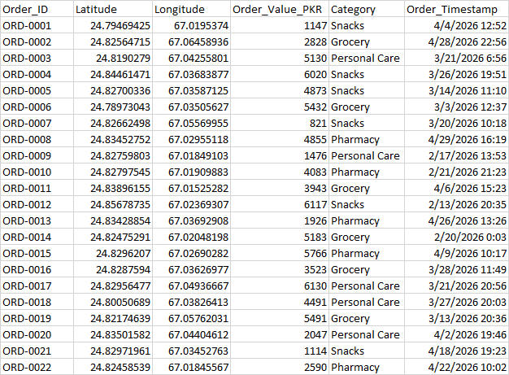
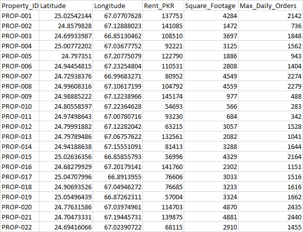
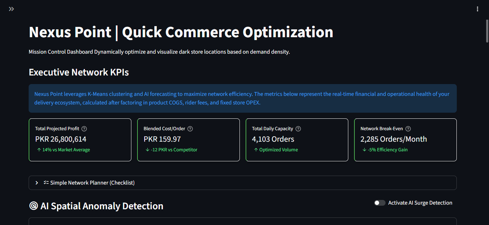
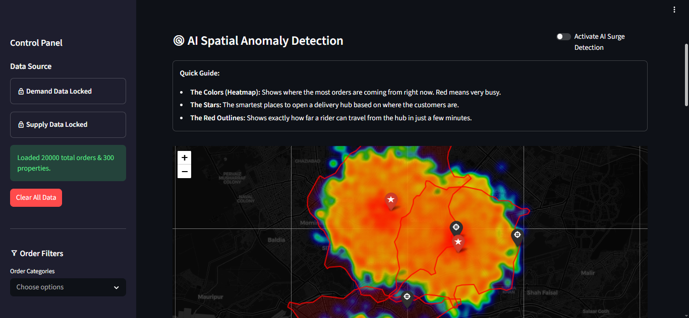
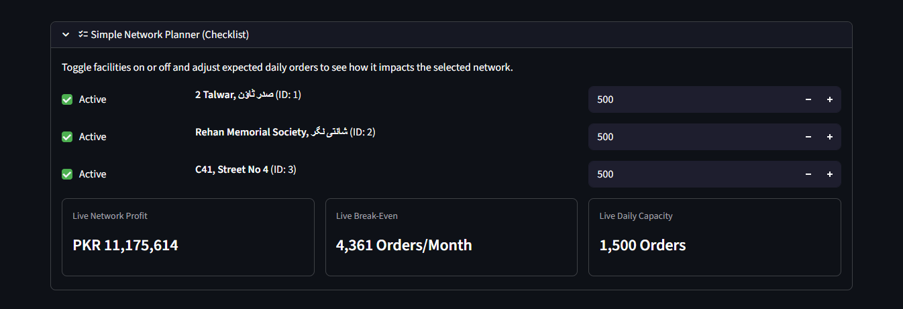
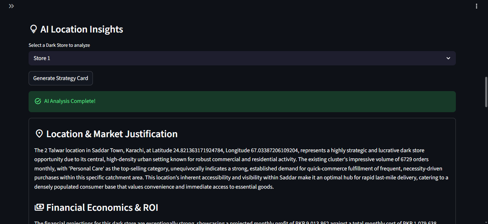
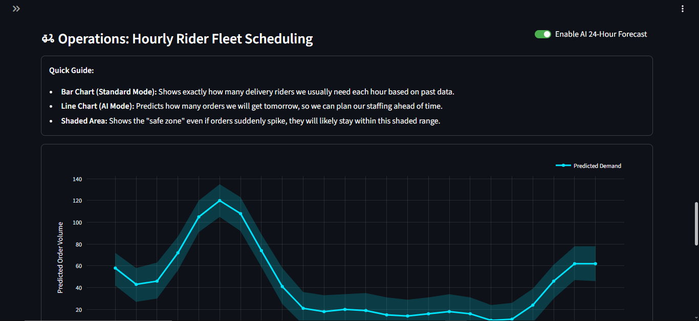
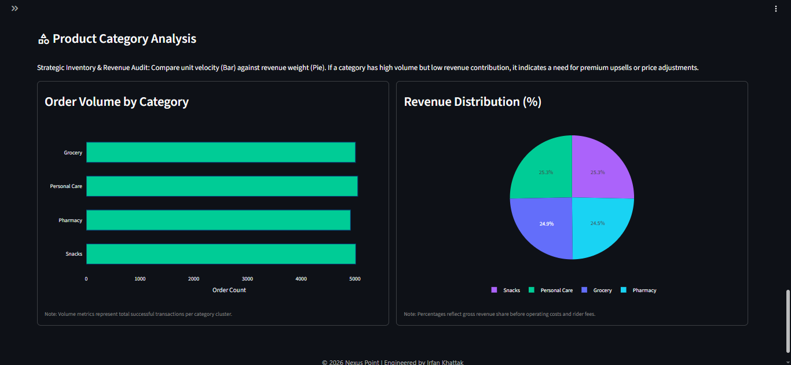

# Nexus Point | Quick Commerce Optimization 🚀

**Nexus Point** is an advanced, executive-level Streamlit dashboard designed to optimize Quick Commerce (q-commerce) delivery networks. By fusing machine learning, geospatial analytics, and generative AI, Nexus Point empowers operations managers to visualize live demand, perfectly position delivery hubs, and dynamically simulate unit economics in real-time.

---

## 🚀 Deployment & Live Demo

**Live Dashboard:** [Click here to launch the application](https://nexuspointquickcommerce2026-k4uvqxnybqbmgxbctgmjtu.streamlit.app)

This application is deployed live on **Streamlit Community Cloud**.

> ⚠️ **Live Demo Notice:** To optimize cloud resources, this Streamlit application pauses after periods of inactivity. Please allow roughly 15 seconds for the engine to cold-boot upon your first visit. 
> 
> **API Quota Protection:** To maintain platform stability and protect free-tier API quotas, the AI Strategy Analyst feature is capped at **5 interactions per user session** and 100 global requests per day. If these limits are reached, the AI will enter a resting state until the next day, but the core K-Means clustering and geospatial mapping features will remain fully operational.

---

## 📖 Overview

In the highly competitive world of under-20-minute delivery, the difference between profitability and massive cash burn comes down to **network geometry** and **fleet utilization**.

Nexus Point solves this by ingesting raw order logs and available real estate properties to automatically recommend the optimal "Dark Store" hub locations. It evaluates localized demand, maps competitor threat radiuses, flags AI-detected demand surges, and translates predictive forecasts into exact rider headcount requirements.

---

## 📊 Required Data Schemas

> **🛡️ Disclaimer on Data Privacy:** *All datasets used and provided in this repository (including the examples below) consist entirely of synthetically generated data. No real-world e-commerce, customer, or proprietary corporate data is used, as such information is highly sensitive and strictly confidential.*

To utilize the Nexus Point dashboard, operations managers must upload two distinct datasets: **Demand Data** (Customer Orders) and **Supply Data** (Available Real Estate). 

The system relies on specific column headers to process geospatial clustering, financial KPIs, and AI forecasting correctly. Both files must be in `.csv` format.

### 1. Demand Data (`orders.csv`)
This dataset represents historical customer transactions. It is used to generate the spatial heatmaps, run the K-Means clustering algorithm, and feed the Prophet ML model for time-series forecasting.

| Column Name | Data Type | Description |
| :--- | :--- | :--- |
| `Order_ID` | String | Unique identifier for the transaction. |
| `Latitude` | Float | The exact geospatial latitude of the customer delivery location. |
| `Longitude` | Float | The exact geospatial longitude of the customer delivery location. |
| `Order_Value_PKR` | Numeric | The gross cart value (used for revenue and profit calculations). |
| `Category` | String | The primary product category (e.g., Grocery, Snacks, Pharmacy). |
| `Order_Timestamp` | Datetime | The exact date and time of the order (Format: `YYYY-MM-DD HH:MM:SS`). |



### 2. Supply Data (`properties.csv`)
This dataset represents the available commercial real estate that can be converted into "Dark Stores". The engine cross-references these locations against the demand centroids to find the most cost-effective and geographically strategic hubs.

| Column Name | Data Type | Description |
| :--- | :--- | :--- |
| `Property_ID` | String | Unique identifier for the real estate listing. |
| `Latitude` | Float | The geospatial latitude of the property. |
| `Longitude` | Float | The geospatial longitude of the property. |
| `Rent_PKR` | Numeric | The monthly lease cost of the facility (used for break-even analysis). |
| `Square_Footage` | Numeric | The physical size of the location. |
| `Max_Daily_Orders` | Numeric | The maximum fulfillment capacity the location can handle per day. |



---

## 📸 Platform Features & Visuals

### 1. Mission Control & Executive KPIs
Provides a real-time, high-level overview of network health. It instantly calculates total projected profit, blended cost per order, total daily capacity, and network break-even points by factoring in product COGS, rider fees, and fixed store OPEX.



### 2. AI Spatial Mapping & Anomaly Detection
An interactive Folium map that visualizes exact customer demand density. It plots the optimal dark store centroids using K-Means clustering, overlays competitor threat radiuses, and uses an Isolation Forest algorithm to flag highly-localized flash surges.



### 3. Dynamic Network Planner
A tactical operations checklist allowing managers to toggle specific facilities on or off. The system instantly recalculates the live network profit, break-even targets, and maximum daily capacity based on the active hubs.



### 4. AI Location Insights (Gemini 3.6 Flash Strategy)
Leverages Google AI Studio to generate a comprehensive, automated strategy card for any selected dark store. It analyzes order counts, top product categories, and local competitor threats to provide actionable operational directives under strict safety quotas.



### 5. Operations: Rider Fleet Scheduling
Translates raw, time-series volume predictions (via Prophet ML) into exact human headcount requirements. The hourly charts allow operations managers to precisely schedule delivery riders to match forecasted demand peaks without overstaffing.



### 6. Product Category Analysis
Custom, meticulously aligned Plotly charts that audit inventory performance. By comparing unit velocity (Bar Chart) against revenue weight (Pie Chart), it highlights which categories drive volume versus actual profitability.



---

## 🏗️ Architecture & Project Structure

The project strictly follows a "Separation of Concerns" architecture to keep the Streamlit UI clean, fast, and maintainable.

```text
nexus_point_2026/
├── app.py                  # The main Streamlit orchestrator (Layout, State, Routing)
├── requirements.txt        # Python dependencies
├── .streamlit/
│   ├── secrets.toml        # streamlit secrets (API Keys) --> refere to the section 4
├── data/
│   ├── generator.py        # Script to generate synthetic geospatial order data
│   ├── orders.csv          # Demand data
│   └── properties.csv      # Supply data (Available real estate)
├── src/
│   ├── engine.py           # Core ML engine (K-Means, Prophet forecasting, Isolation Forest)
│   └── ai_analyst.py       # Integration with Google Gemini for LLM-powered Strategy Cards
└── ui/
    ├── style.css           # Custom CSS injection for the "Dark SaaS" aesthetic
    ├── map_factory.py      # Folium map generation and HTML marker popups
    └── chart_factory.py    # Complex Plotly graph objects
```

---

## 🛠️ Tech Stack

Nexus Point is built entirely in Python, leveraging the most powerful data science libraries available:

### 1. Application & UI
* **Streamlit:** The core framework powering the reactive frontend and backend logic.
* **Custom CSS:** Extensive CSS injection to override default Streamlit styles, creating a premium "Dark SaaS" look.

### 2. Geospatial Intelligence
* **Folium / streamlit-folium:** For rendering and seamlessly embedding interactive maps into the Streamlit DOM.

### 3. Machine Learning & Analytics
* **Scikit-Learn:** Powers the K-Means clustering (hub placement) and Isolation Forest (spatial anomaly detection).
* **Prophet:** Handles advanced time-series forecasting to predict future hourly demand volume.
* **Pandas & NumPy:** The backbone for all data manipulation and dynamic financial math.

### 4. Data Visualization
* **Plotly:** Used exclusively for high-fidelity, interactive charts (Bar, Donut, and Predictive Line graphs).

### 5. Generative AI
* **Google Generative AI SDK (`google-generativeai`):** Connects natively to Gemini 3.6 Flash Model to generate human-readable Executive Strategy Cards right out of your local or cloud secrets matrix.

---

## ✨ Key Features

### 📍 Dynamic Hub Clustering (K-Means)
The dashboard groups thousands of live orders into distinct geographic clusters. It then calculates the exact geometric centroid of each cluster and matches it against your available real-estate supply to recommend the optimal Dark Store locations.

### 💸 Live Unit Economics Engine
Adjust Average Order Value (AOV), Rider Fees, and Fixed Store OPEX via intuitive sliders. The dashboard instantly recalculates Projected Profit, Blended Cost/Order, and Network Break-Even, taking into account a standard 25% gross product margin (COGS).

### 🚨 AI Spatial Anomaly Detection
With the flip of a switch, the system deploys an Isolation Forest algorithm to detect localized demand anomalies (flash surges) and plots them on the map with actionable fleet deployment protocols.

### 📈 Predictive Fleet Forecasting
Instead of just showing raw predicted orders, Nexus Point translates time-series volume forecasts into Required Delivery Riders (using `np.ceil`), ensuring operations managers know exactly how many humans to schedule per hour.

---

## 🚀 How to Run Locally

1. **Clone the repository:**
   ```bash
   git clone https://github.com/Irfan-code-cloud/nexuspoint_quick_commerce_2026.git
   cd nexus_point_2026
   ```

2. **Install the dependencies:**
   It is recommended to use a virtual environment.
   ```bash
   pip install -r requirements.txt
   ```

3. **Set up Local Secrets Management:**
  Streamlit reads configuration variables out of a local `.streamlit` configuration directory. Create the folder and config file in your root environment:

  ```bash
  mkdir .streamlit
  touch .streamlit/secrets.toml
```

4. **Open `.streamlit/secrets.toml` and drop your API credentials:**

   ```Ini, TOML
   GEMINI_API_KEY = "your_google_ai_studio_api_key_here"
   ORS_API_KEY = "your_openrouteservice_api_key_here"
   OPENWEATHER_API_KEY = "your_openweather_api_key_here"
   ```

5. **Launch the application:**

   ```bash
   streamlit run app.py
   ```

*Enjoy optimizing the future of delivery! 📦⚡*

*Engineered by Irfan Khattak*

